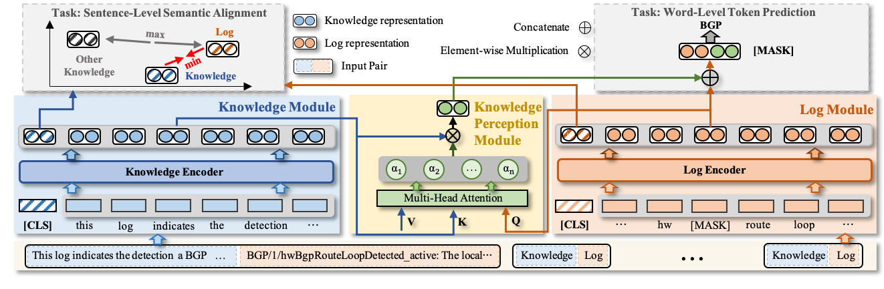
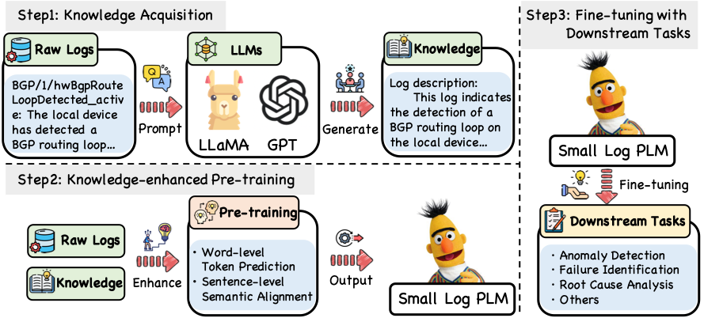
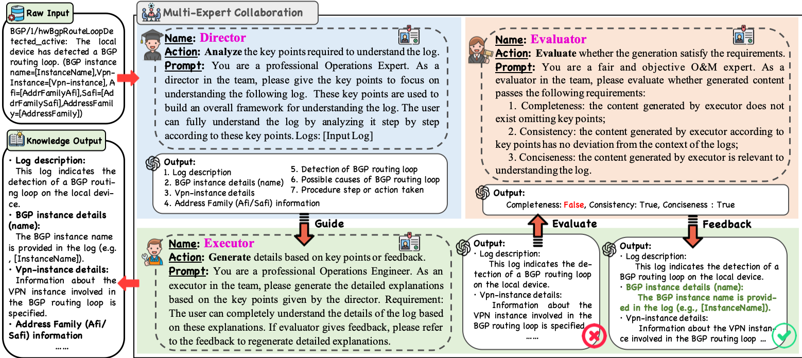

# LUK: Empowering Log Understanding with Expert Knowledge from Large Language Models

This repository contains PyTorch implementation for LUK: Empowering Log Understanding with Expert Knowledge from Large Language Models.

Logs play a critical role in providing essential information for system monitoring and troubleshooting. Recently, with the success of pre-trained language models (PLMs) and large language models (LLMs) in natural language processing (NLP), smaller PLMs (such as BERT) and LLMs (like GPT-4) have become the current mainstream approaches for log analysis. Despite the remarkable capabilities of LLMs, their higher cost and inefficient inference present significant challenges in leveraging the full potential of LLMs to analyze logs. In contrast, smaller PLMs can be fine-tuned for specific tasks even with limited computational resources, making them more practical. However, these smaller PLMs face challenges in understanding logs comprehensively due to their limited expert knowledge. To address the lack of expert knowledge and enhance log understanding for smaller PLMs, this paper introduces a novel and practical knowledge enhancement framework, called LUK, which acquires expert knowledge from LLMs automatically and then enhances the smaller PLM for log analysis with these expert knowledge. LUK can take full advantage of both types of models. Specifically, we design a multi-expert collaboration framework based on LLMs with different roles to acquire expert knowledge. In addition, we propose two novel pre-training tasks to enhance the log pre-training with expert knowledge. LUK achieves state-of-the-art results on different log analysis tasks and extensive experiments demonstrate expert knowledge from LLMs can be utilized more effectively to understand logs. 


The conceptual overview of LUK:



Based on the classical waterfall model in software engineering, we design a similar waterfall model to analyze logs consisting of three stages: analysis, execution, and evaluation.



## Usage

### Requirements

- transformers
- numpy
- torch
- huggingface-hub
- vllm
- tokenizers
- scikit-learn
- tqdm

```
pip install -r requirements.txt
```

#### Structure of Files

```
LUK
 |-- datasets	
 |    |-- downstream_result # Results of Chatgpt and Llama2-13B on downstream tasks
 |    |-- examples 
 |    |-- pre-train # Pre-training datasets
 |    |-- tasks # Downstream tasks datasets
 
 
 |-- sentence_transformers # We modified the code for losses, evaluation and SentenceTransformerEnhance to implement LUK
 |    |-- cross_encoder
 |    |-- datasets
 |    |-- evaluation
 |    |-- losses
 |    |-- models
 |    |-- readers
 |    |-- __init__.py
 |    |-- LoggingHandler.py
 |    |-- model_card_templates.py
 |    |-- SentenceTransformer.py 
 |    |-- SentenceTransformerEnhance.py  #  enhance with LUK
 |    |-- util.py

 |-- Llama2_inference_down_task.py # evaluate Llama2 on the specific task

 |-- Llama2_MEC.py # acquire knowledge from LLMs based on MEC
 
 |-- LUK_LDSM_task.py # evaluate LUK on LDSM
 
 |-- LUK_LPCR_task.py # evaluate LUK on LPCR
 
 |-- LUK_MC_task.py # evaluate LUK on MC
 
 |-- LUK_pretrain.py # pre-train main
 
 |-- mec_llama3.py # acquire knowledge from LLMs based on MEC
 
```


### Pre-training Dataset
We collecte 43,229 logs from Software System Cisco and Network Device. The data statistics are as follows:

| **Datasets**    | **Category**       | **# Num** |
|-----------------|--------------------|-----------|
| Software System | Distributed System | 2,292     |
|                 | Operating System   | 11,947    |
| Network Device  | Cisco              | 16,591    |
|                 | Huawei             | 12,399    |
| Total           |                    | 43,229    |

All pre-training datasets are put under this [folder](https://github.com/LeaperOvO/LUK/tree/master/datasets/pre-train).

### Downstream tasks Dataset
To explore the performance of LUK on different log analysis domains, we conduct experiments on different downstream tasks, including software systems and network device logs. 

For anomaly detection task, we collect datasets from [LogHub](https://github.com/logpai/loghub).

For failure identification task, we collect datasets from this [url](https://figshare.com/articles/dataset/Failure_dataset/7732268?file=22583342).

For other knowledge-intensive network device logs, they have been organized under the [folder](https://github.com/LeaperOvO/LUK/tree/master/datasets/tasks)。

For the Fault Phenomenon Identification task, the dataset is based on operational data collected from enterprise systems. Due to data privacy concerns, this dataset is currently not publicly available. However, we are actively working on anonymizing and desensitizing the data, and we plan to release it progressively soon.


### Required pre-trained models
In our code, we use 'bert-base-uncased'  as the pre-trained model, and you can use 'bert-base-uncased' directly or download [bert-base-uncased](https://huggingface.co/bert-base-uncased) into your directory.

### MEC

To acquire knowledge from LLMs based on MEC, you can run:

```
python mec_llama3.py  --data ./datasets/pre-train/expert_chatgpt_output.json --model_path ./Llama-3.3-70B-Instruct --save_path ./expert_llama3_output.json
```
Note: we use vLLM to load meta-llama/Llama-3.3-70B-Instruct, and the model you can download from [meta-llama/Llama-3.3-70B-Instruct](https://huggingface.co/meta-llama/Llama-3.3-70B-Instruct) 

### Training

To train LUK from scratch, run:

```
python LUK_pretrain.py --pretrain_data ./datasets/pre-train/expert_chatgpt_output.json --base_model bert-base-uncased
```

expert_chatgpt_output.json is the example of MEC based ChatGPT. LUK is pretrained on all data together, and you can merge all pre-train datasets.

### Evaluation

To evaluate the model on the specific task with LUK, for example, on the LDSM task, you can run:

```
python LUK_LDSM_task.py --train_data ./datasets/tasks/LDSM/hw_switch_train.json --dev_data ./datasets/tasks/MC/hw_switch_dev.json --test_data ./datasets/tasks/MC/hw_switch_test.json
```

To evaluate the model on the specific task with Llama3, for example, on the LDSM task, you can run:

```
python Llama3_inference_downtask.py --data ./datasets/tasks/LDSM/hw_switch_test.json --model_path ./llama3-70b --save_path ./downstream_result/Llama3_result/LDSM/ldsm_hwswitch_result_llama3.json
```
Note, for software logs downstream tasks, we collect datasets from [LogHub](https://github.com/logpai/loghub) and based on [LogPAI](https://github.com/logpai) to experiment

## License
MIT License

## Acknowledgements

Our code is inspired by [sentence-transformers](https://github.com/UKPLab/sentence-transformers/tree/master), [Hugging Face](https://huggingface.co/), [vLLM](https://github.com/vllm-project/vllm)

Our pre-training datasets and downstream tasks datasets are collected from [LogHub](https://github.com/logpai/loghub) and public documentation [Cisco](https://www.cisco.com/c/en/us/support/index.html), [Huawei](https://support.huawei.com/enterprise/en/index.html) and [H3C](https://www.h3c.com/en/Support/).
